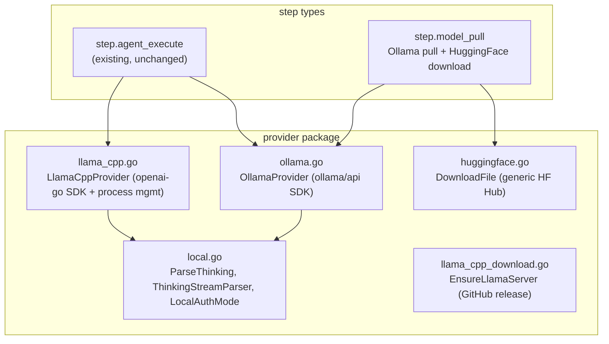

# Local Inference Providers: Ollama + llama.cpp

**Date:** 2026-03-27
**Status:** Approved

## Goal

Add local model inference to workflow-plugin-agent via two new providers (Ollama and llama.cpp), enabling self-hosted reasoning models like Qwen3.5 with Claude-style `<think>` traces — no cloud API keys required.

**Use case split:**
- **Ollama** — developer workstations, local experimentation, quick model swapping
- **llama.cpp** — cloud GPU instances, CI/CD inference, production self-hosted, custom/fine-tuned GGUF models

## Architecture: Shared Base + Provider Specializations



## 1. Core Interface Changes

Add `Thinking` field to `Response` and `StreamEvent` in `provider/provider.go`:

```go
type Response struct {
    Content   string     `json:"content"`
    Thinking  string     `json:"thinking,omitempty"`  // reasoning trace
    ToolCalls []ToolCall `json:"tool_calls,omitempty"`
    Usage     Usage      `json:"usage"`
}

type StreamEvent struct {
    Type     string    `json:"type"` // "text", "thinking", "tool_call", "done", "error"
    Text     string    `json:"text,omitempty"`
    Thinking string    `json:"thinking,omitempty"`
    Tool     *ToolCall `json:"tool,omitempty"`
    Error    string    `json:"error,omitempty"`
    Usage    *Usage    `json:"usage,omitempty"`
}
```

Existing providers are unaffected — they never populate `Thinking`.

## 2. Shared Local Helpers (`provider/local.go`)

**Think tag parsing:**
```go
// ParseThinking extracts <think>...</think> blocks from model output.
func ParseThinking(raw string) (thinking, content string)
```

**Streaming state machine:**
```go
// ThinkingStreamParser tracks state across streaming chunks to split
// thinking vs content tokens. Handles <think> split across chunks.
type ThinkingStreamParser struct { ... }
func (p *ThinkingStreamParser) Feed(chunk string) []StreamEvent
```

**Local auth mode helper:**
```go
func LocalAuthMode(name, display string) AuthModeInfo
```

## 3. Ollama Provider (`provider/ollama.go`)

Uses `github.com/ollama/ollama/api` SDK (lightweight client-only package).

```go
type OllamaConfig struct {
    Model      string // e.g. "qwen3.5:27b-q4_K_M"
    BaseURL    string // default: "http://localhost:11434"
    MaxTokens  int
    HTTPClient *http.Client
}
```

**Capabilities:**
- `Chat()` / `Stream()` via `api.Client.Chat()` with streaming callback
- `Pull()` — model download via `api.Client.Pull()` with progress
- `ListModels()` — via `api.Client.List()`
- `Health()` — via `api.Client.Heartbeat()`
- Message and tool type conversion: `api.Message` ↔ `provider.Message`
- `ThinkingStreamParser` applied to chat output

**Module config:**
```yaml
modules:
  local-ai:
    type: agent.provider
    config:
      type: ollama
      model: "qwen3.5:27b-q4_K_M"
```

## 4. llama.cpp Provider (`provider/llama_cpp.go`)

Connects to OpenAI-compatible server with optional process management.

```go
type LlamaCppConfig struct {
    BaseURL      string // external mode if set
    ModelPath    string // managed mode if set (path to .gguf)
    BinaryPath   string // override llama-server location
    GPULayers    int    // -ngl flag, default: -1 (all)
    ContextSize  int    // -c flag, default: 8192
    Threads      int    // -t flag, default: runtime.NumCPU()
    Port         int    // default: 8081
    MaxTokens    int
    HTTPClient   *http.Client
}
```

**Two modes:**

1. **External** (`BaseURL` set): OpenAI SDK pointed at URL. Works with any OpenAI-compatible server (llama-server, vLLM, TGI, etc.)

2. **Managed** (`ModelPath` set): Provider manages llama-server lifecycle:
   - Binary resolution: `BinaryPath` → `PATH` lookup → auto-download from GitHub releases
   - Process start: spawn llama-server with configured flags
   - Health wait: poll `/health` until ready
   - Process stop: kill on close/context cancellation

**Auto-download** (`provider/llama_cpp_download.go`):
```go
// EnsureLlamaServer finds or downloads the llama-server binary.
// Order: config path → PATH → ~/.cache/workflow/llama-server/<version>/
// Downloads from ggerganov/llama.cpp GitHub releases.
func EnsureLlamaServer(ctx context.Context) (string, error)
```

Both modes apply `ThinkingStreamParser` to output.

**Module config examples:**
```yaml
# External server
modules:
  local-llm:
    type: agent.provider
    config:
      type: llama_cpp
      base_url: "http://localhost:8081/v1"
      model: "qwen3.5-27b"

# Managed process
modules:
  local-llm:
    type: agent.provider
    config:
      type: llama_cpp
      model: "/models/Qwen3.5-27B-Q4_K_M.gguf"
      # gpu_layers: -1
      # context_size: 8192
```

## 5. `step.model_pull` Step Type

Ensures a model is available before agent execution. Two sources:

**Ollama:**
```yaml
- name: ensure_model
  type: step.model_pull
  config:
    provider: ollama
    model: "qwen3.5:27b-q4_K_M"
    base_url: "http://localhost:11434"  # optional
```

**HuggingFace** (generic — works with any HF repo/file, not GGUF-specific):
```yaml
- name: download_model
  type: step.model_pull
  config:
    provider: huggingface
    model: "Jackrong/Qwen3.5-27B-Claude-4.6-Opus-Reasoning-Distilled-GGUF"
    file: "Qwen3.5-27B-Q4_K_M.gguf"
    output_dir: "/models"  # default: ~/.cache/workflow/models/
```

**Output:** `{status: "ready"|"downloaded"|"error", model_path: string, size_bytes: int}`

**HuggingFace downloader** (`provider/huggingface.go`):
```go
// DownloadFile downloads any file from a HuggingFace model repo.
// Uses HF Hub REST API with resume support (Range header).
func DownloadFile(ctx context.Context, repo, filename, outputDir string, progress func(pct float64)) (string, error)
```

## 6. Executor & Transcript Changes

**Executor** (`executor/executor.go`):
- When `resp.Thinking != ""`, record transcript entry with type `"thinking"`
- Include `thinking` in step output: `{result, thinking, status, iterations, error}`
- Forward `"thinking"` stream events to SSE listeners

**Step output** (`step_agent_execute.go`):
- Add `output["thinking"] = resp.Thinking`
- Accessible as `{{ index .steps "agent" "thinking" }}`

**No changes to:** Provider interface (beyond Section 1), tool registry, approval gates, context compaction.

## 7. Registry & Plugin Wiring

**provider_registry.go** — add `"ollama"` and `"llama_cpp"` factories
**module_provider.go** — add cases for both types
**plugin.go** — register `step.model_pull`, update module schemas with new provider types
**auth_modes.go** — add `ollama` and `llama_cpp` local auth modes
**models.go** — add model listing for both providers

## 8. Testing Strategy

All tests use HTTP mocks — no live GPU or model downloads in CI.

- `ThinkingStreamParser` — chunked input, split tags, nested tags, unclosed tags
- `ParseThinking` — simple extraction, no-think content, multiple blocks
- Ollama provider — mock HTTP server returning Ollama API responses
- llama.cpp provider — mock OpenAI-compatible server, managed mode lifecycle
- HuggingFace download — mock server with Range request support, resume
- `step.model_pull` — integration with mock endpoints
- Executor thinking — verify thinking in transcript entries and step output

## 9. File Summary

```
provider/
  provider.go             MODIFY  add Thinking to Response/StreamEvent
  local.go                NEW     ParseThinking, ThinkingStreamParser, LocalAuthMode
  local_test.go           NEW     think parser tests
  ollama.go               NEW     OllamaProvider
  ollama_convert.go       NEW     api.Message ↔ provider.Message
  ollama_test.go          NEW     unit tests
  llama_cpp.go            NEW     LlamaCppProvider
  llama_cpp_download.go   NEW     EnsureLlamaServer
  llama_cpp_test.go       NEW     unit tests
  huggingface.go          NEW     DownloadFile (generic HF Hub)
  huggingface_test.go     NEW     unit tests
  auth_modes.go           MODIFY  add local auth modes
  models.go               MODIFY  add local model listing

provider_registry.go      MODIFY  add ollama + llama_cpp factories
module_provider.go        MODIFY  add ollama/llama_cpp cases
step_model_pull.go        NEW     step.model_pull
step_model_pull_test.go   NEW     tests
plugin.go                 MODIFY  register step.model_pull, update schemas

executor/
  executor.go             MODIFY  thread thinking into transcript + output
```

## 10. Dependencies

**New:**
- `github.com/ollama/ollama/api` — Ollama client (lightweight, client-only)

**Existing (reused):**
- `github.com/openai/openai-go` — for llama.cpp OpenAI-compatible protocol
- `net/http` — HuggingFace downloads, llama-server health checks
- `os/exec` — managed llama-server process
