# Executor Mesh Support Implementation Plan

**Date:** 2026-04-04
**Design:** [2026-04-04-executor-mesh-support-design.md](2026-04-04-executor-mesh-support-design.md)
**Repo:** workflow-plugin-agent
**Downstream:** ratchet-cli agent mesh — implement this plan first, tag a release, then proceed with ratchet-cli mesh implementation.

## Steps

### Step 1: Event Types

Create `executor/events.go`.

- `EventType` string type with constants: `EventToolCallStart`, `EventToolCallResult`, `EventThinking`, `EventText`, `EventIteration`, `EventCompleted`, `EventFailed`
- `Event` struct with fields: Type, AgentID, Iteration, Content, ToolName, ToolCallID, ToolArgs, ToolResult, ToolError, Error

**Tests:** None (pure types).

**Files:** `executor/events.go`

---

### Step 2: Config Extensions

Modify `executor/executor.go`.

- Add three fields to `Config`:
  - `Inbox <-chan provider.Message`
  - `OnEvent func(Event)`
  - `ShouldStop func() (reason string)`
- No changes to default behavior when fields are nil

**Tests:** Verify existing tests still pass with zero-value new fields.

**Files:** `executor/executor.go`

---

### Step 3: Inbox Drain

Modify `executor/executor.go` — the main loop in `Execute()`.

- At the top of each iteration (before compaction is checked and before `provider.Chat()`), call a new `drainInbox()` helper
- `drainInbox()` does a non-blocking select loop on `cfg.Inbox`, appending any received messages to the conversation so injected messages are visible to subsequent compaction checks
- If `cfg.Inbox` is nil, skip entirely
- Record drained messages via TranscriptRecorder

**Tests:** `executor_test.go` — test with a `ChannelProvider` and a buffered inbox channel. Send a message mid-execution, verify it appears in the conversation context (visible via tool call args or final response referencing the injected content).

**Files:** `executor/executor.go`, `executor/executor_test.go`

---

### Step 4: Event Emission

Modify `executor/executor.go` — emit events at each loop point.

- Helper: `emit(cfg, event)` — calls `cfg.OnEvent(event)` if non-nil
- Emit `EventIteration` at start of each loop iteration
- Emit `EventThinking` after LLM response if `resp.Thinking != ""`
- Emit `EventText` after LLM response if `resp.Content != ""`
- Emit `EventToolCallStart` before each tool execution
- Emit `EventToolCallResult` after each tool execution
- Emit `EventCompleted` or `EventFailed` at loop exit

**Tests:** `executor_test.go` — run with a scripted provider and an `OnEvent` callback that collects events into a slice. Verify the correct sequence: iteration → thinking → text → tool_call_start → tool_call_result → completed.

**Files:** `executor/executor.go`, `executor/executor_test.go`

---

### Step 5: Custom Termination

Modify `executor/executor.go` — add ShouldStop check.

- After all tool calls in an iteration are processed, before the next loop iteration, call `cfg.ShouldStop()` if non-nil
- If it returns a non-empty string, emit `EventCompleted` and return `Result{Content: reason, Status: "completed"}`
- If nil, skip (existing behavior)

**Tests:** `executor_test.go` — scripted provider that makes tool calls, ShouldStop returns non-empty after 2 iterations. Verify loop exits early with "completed" status.

**Files:** `executor/executor.go`, `executor/executor_test.go`

---

### Step 6: Integration Test

Create `executor/mesh_support_test.go`.

- End-to-end test simulating mesh usage: scripted provider, inbox channel with delayed messages, OnEvent collector, ShouldStop after seeing a specific tool call
- Verify: inbox messages appear in conversation, events stream in correct order, early termination works
- Uses `ScriptedProvider` — no real LLM needed

**Files:** `executor/mesh_support_test.go`

---

## Dependency Graph

```mermaid
graph LR
    S1[Step 1: Event Types] --> S4[Step 4: Event Emission]
    S2[Step 2: Config Extensions] --> S3[Step 3: Inbox Drain]
    S2 --> S4
    S2 --> S5[Step 5: Custom Termination]
    S3 --> S6[Step 6: Integration Test]
    S4 --> S6
    S5 --> S6
```

**Parallelizable:** Steps 3, 4, 5 can be done in parallel after steps 1-2.

## Release

After all steps pass:
1. Tag `v0.5.3` (or next minor) in workflow-plugin-agent
2. Update ratchet-cli's `go.mod` to reference the new tag
3. Proceed with ratchet-cli mesh implementation plan
