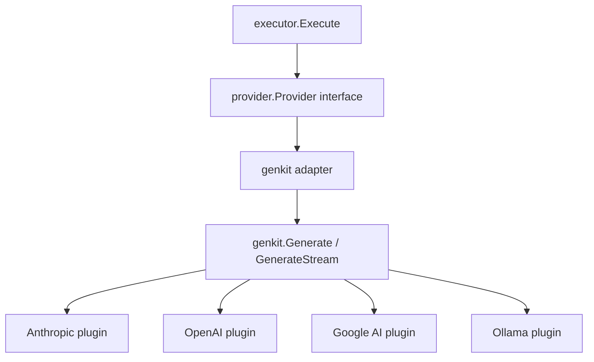

# Genkit Provider Migration Design

**Date:** 2026-04-05
**Repo:** workflow-plugin-agent
**Goal:** Replace all hand-rolled provider implementations with Google Genkit Go SDK adapters, keeping the `provider.Provider` interface unchanged.

## Scope

- **Replace:** All 12+ provider implementation files with Genkit plugin adapters
- **Keep:** `provider.Provider` interface, `executor/`, `tools/`, `orchestrator/`, mesh support, test providers
- **Gain:** Unified SDK, structured output, built-in tracing, MCP support, fewer direct dependencies

## Architecture



Genkit is an **internal implementation detail**. The `provider.Provider` interface is unchanged. All consumers (executor, ratchet-cli, mesh, orchestrator) work without modification.

## What Gets Deleted

- `provider/anthropic.go`, `anthropic_bedrock.go`, `anthropic_foundry.go`, `anthropic_vertex.go`
- `provider/anthropic_convert.go`, `anthropic_convert_test.go`
- `provider/openai.go`, `openai_azure.go`, `openai_azure_test.go`
- `provider/gemini.go`, `gemini_test.go`
- `provider/ollama.go`, `ollama_convert.go`, `ollama_test.go`, `ollama_convert_test.go`
- `provider/copilot.go`, `copilot_test.go`, `copilot_models.go`, `copilot_models_test.go`
- `provider/openrouter.go`, `openrouter_test.go`
- `provider/cohere.go`
- `provider/huggingface.go`, `huggingface_test.go`
- `provider/llama_cpp.go`, `llama_cpp_test.go`, `llama_cpp_download.go`, `llama_cpp_download_test.go`
- `provider/local.go`, `local_test.go`
- `provider/ssrf.go`, `provider/models_ssrf_test.go`
- `provider/auth_modes.go` (simplified into adapter)

## What Stays

- `provider/provider.go` — interface + types (`Message`, `ToolDef`, `ToolCall`, `StreamEvent`, `Response`, `Usage`, `AuthModeInfo`)
- `provider/models.go` — model registry/definitions (if still needed for model metadata)
- `provider/test_provider.go`, `test_provider_channel.go`, `test_provider_http.go`, `test_provider_scripted.go` — test infrastructure
- `provider/thinking_field_test.go` — test for thinking trace parsing
- `executor/` — entire package unchanged
- `tools/` — entire package unchanged
- `orchestrator/` — entire package unchanged (ProviderRegistry updated to use new factories)

## New Package: `genkit/`

```
genkit/
  genkit.go          — Init(), singleton Genkit instance, plugin registration
  adapter.go         — genkitProvider implementing provider.Provider
  convert.go         — Bidirectional type conversion (our types ↔ Genkit ai types)
  providers.go       — Factory functions per provider type
  providers_test.go  — Tests with mock Genkit model
```

### genkit.go — Initialization

```go
package genkit

// Init creates and returns a Genkit instance with all available plugins registered.
// Call once at startup. Thread-safe after initialization.
func Init(ctx context.Context, opts ...Option) (*genkit.Genkit, error)

type Option func(*initConfig)
func WithAnthropicKey(key string) Option
func WithOpenAIKey(key string) Option
func WithGoogleAIKey(key string) Option
func WithOllamaHost(host string) Option
// etc.
```

### adapter.go — Provider Adapter

```go
// genkitProvider adapts a Genkit model to provider.Provider.
type genkitProvider struct {
    g        *genkit.Genkit
    model    ai.Model          // resolved Genkit model
    name     string            // provider identifier
    authInfo provider.AuthModeInfo
    config   map[string]any    // model-specific generation config
}

func (p *genkitProvider) Name() string
func (p *genkitProvider) AuthModeInfo() provider.AuthModeInfo
func (p *genkitProvider) Chat(ctx, messages, tools) (*provider.Response, error)
func (p *genkitProvider) Stream(ctx, messages, tools) (<-chan provider.StreamEvent, error)
```

`Chat()` calls `genkit.Generate()` and converts the response.
`Stream()` calls `genkit.Generate()` with streaming and converts chunks to `StreamEvent` on a channel.

### convert.go — Type Conversion

```go
// toGenkitMessages converts []provider.Message → []ai.Message
func toGenkitMessages(msgs []provider.Message) []*ai.Message

// toGenkitTools converts []provider.ToolDef → []ai.Tool (via genkit.DefineTool or inline)
func toGenkitTools(g *genkit.Genkit, tools []provider.ToolDef) []*ai.Tool

// fromGenkitResponse converts *ai.ModelResponse → *provider.Response
func fromGenkitResponse(resp *ai.ModelResponse) *provider.Response

// fromGenkitChunk converts ai.ModelResponseChunk → provider.StreamEvent
func fromGenkitChunk(chunk *ai.ModelResponseChunk) provider.StreamEvent
```

### providers.go — Factory Functions

```go
// NewAnthropicProvider creates a provider backed by Genkit's Anthropic plugin.
func NewAnthropicProvider(cfg AnthropicConfig) (provider.Provider, error)

// NewOpenAIProvider creates a provider backed by Genkit's OpenAI plugin.
func NewOpenAIProvider(cfg OpenAIConfig) (provider.Provider, error)

// NewGoogleAIProvider creates a provider backed by Genkit's Google AI plugin.
func NewGoogleAIProvider(cfg GoogleAIConfig) (provider.Provider, error)

// NewOllamaProvider creates a provider backed by Genkit's Ollama plugin.
func NewOllamaProvider(cfg OllamaConfig) (provider.Provider, error)

// NewOpenAICompatibleProvider handles OpenRouter, Copilot, Cohere, HuggingFace, etc.
func NewOpenAICompatibleProvider(cfg OpenAICompatibleConfig) (provider.Provider, error)

// NewBedrockProvider creates a provider via Genkit's AWS Bedrock plugin.
func NewBedrockProvider(cfg BedrockConfig) (provider.Provider, error)

// NewVertexAIProvider creates a provider via Genkit's Vertex AI plugin.
func NewVertexAIProvider(cfg VertexAIConfig) (provider.Provider, error)

// NewAzureOpenAIProvider creates a provider via Genkit's OpenAI plugin with Azure endpoint.
func NewAzureOpenAIProvider(cfg AzureOpenAIConfig) (provider.Provider, error)
```

Config structs mirror existing provider configs (API key, model, base URL, max tokens, etc.).

## Provider Mapping

| Current Implementation | Genkit Plugin | Factory |
|---|---|---|
| `anthropic.go` (direct API) | `github.com/anthropics/anthropic-sdk-go` via Genkit Anthropic plugin | `NewAnthropicProvider` |
| `anthropic_bedrock.go` | Genkit AWS Bedrock plugin | `NewBedrockProvider` |
| `anthropic_vertex.go` | Genkit Vertex AI plugin | `NewVertexAIProvider` |
| `anthropic_foundry.go` | Genkit Anthropic plugin with custom base URL | `NewAnthropicProvider` |
| `openai.go` | Genkit OpenAI plugin | `NewOpenAIProvider` |
| `openai_azure.go` | Genkit OpenAI plugin with Azure endpoint | `NewAzureOpenAIProvider` |
| `gemini.go` | Genkit Google AI plugin | `NewGoogleAIProvider` |
| `ollama.go` + `ollama_convert.go` | Genkit Ollama plugin | `NewOllamaProvider` |
| `copilot.go` | OpenAI-compatible via Genkit OpenAI plugin | `NewOpenAICompatibleProvider` |
| `openrouter.go` | OpenAI-compatible | `NewOpenAICompatibleProvider` |
| `cohere.go` | OpenAI-compatible | `NewOpenAICompatibleProvider` |
| `huggingface.go` | OpenAI-compatible | `NewOpenAICompatibleProvider` |
| `llama_cpp.go` | Ollama (llama.cpp serves OpenAI-compatible) or Genkit Ollama | `NewOllamaProvider` or `NewOpenAICompatibleProvider` |

## Thinking/Reasoning Trace Support

Models like Claude and Qwen emit thinking traces. Genkit streams these as part of `ModelResponseChunk`. The `fromGenkitChunk()` converter maps:
- Text content → `StreamEvent{Type: "text", Text: ...}`
- Thinking content → `StreamEvent{Type: "thinking", Thinking: ...}`
- Tool calls → `StreamEvent{Type: "tool_call", Tool: ...}`
- Done → `StreamEvent{Type: "done"}`
- Errors → `StreamEvent{Type: "error", Error: ...}`

## ProviderRegistry Update

`orchestrator/provider_registry.go` currently has a `createProvider()` method that switches on provider type and calls constructors like `provider.NewAnthropicProvider()`. This gets updated to call `genkit.NewAnthropicProvider()` etc. The registry interface doesn't change.

## llama.cpp Download Support

The current `llama_cpp_download.go` handles binary downloads and HuggingFace model pulls. This is orthogonal to the provider layer — it can stay as a utility in `provider/` or move to a `local/` package. The llama.cpp *provider* itself gets replaced by Genkit's Ollama plugin (llama.cpp serves an OpenAI-compatible API).

## Dependencies

**Added:**
- `github.com/firebase/genkit/go` (core)
- Genkit provider plugins (anthropic, openai, googleai, ollama, etc.)

**Removed (become transitive via Genkit):**
- `github.com/anthropics/anthropic-sdk-go` (direct)
- `github.com/openai/openai-go` (direct)
- `github.com/google/generative-ai-go` (direct)
- `github.com/ollama/ollama` (direct)

## Testing Strategy

1. **Unit tests:** Mock Genkit model via `ai.DefineModel()` with canned responses. Test adapter conversion, streaming, tool call mapping.
2. **Existing test providers** (`test_provider.go` etc.) remain unchanged — they implement `provider.Provider` directly and don't use Genkit.
3. **Integration tests** (tagged `//go:build integration`): Call real provider APIs via Genkit to verify end-to-end.
4. **Regression:** All existing executor tests must pass unchanged since `provider.Provider` interface is stable.

## Migration Order

1. Add Genkit dependency, create `genkit/` package skeleton
2. Implement `convert.go` (type conversion)
3. Implement `adapter.go` (genkitProvider)
4. Implement `providers.go` (all factory functions)
5. Update `orchestrator/provider_registry.go` to use new factories
6. Delete old provider implementation files
7. Clean up go.mod (remove direct SDK deps that are now transitive)
8. Run full test suite, fix any regressions
9. Tag release
